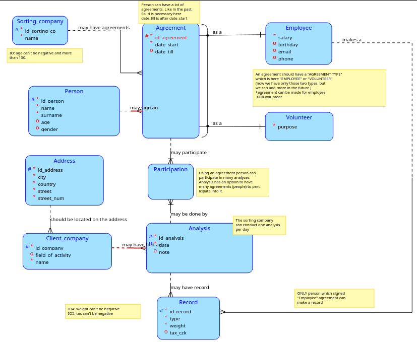
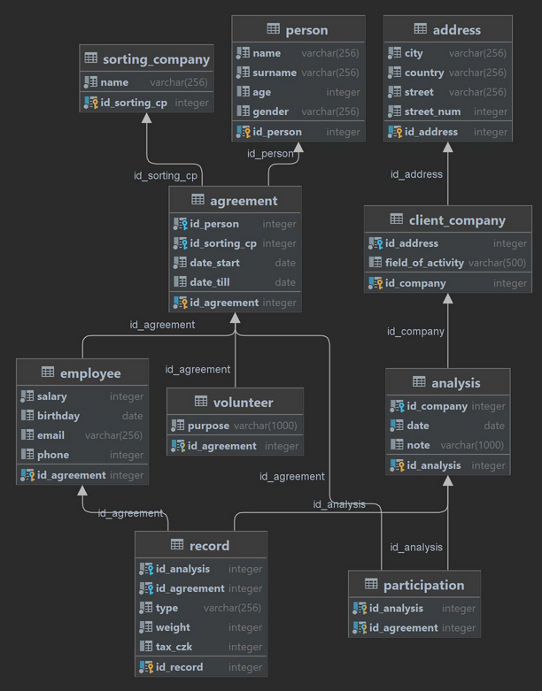

## Disclamer
This repository contains the semester project of the subject [Database Systems](https://courses.fit.cvut.cz/BI-DBS/) studied during the second semester at the Czech Technical University in Prague.

The topic was chosen due to its relevance and the availability of a large amount of information for further analysis, which made the development process not only useful in terms of acquiring new skills, but also interesting.

# Database of waste analyzes

## Project description

The amount of waste big companies produce nowadays is enormous, but responsible entrepreneurs care about our biosphere and try to reduce amount of waste overall or they deal with some special categories. That is why sorting companies exist. Big companies hire them to make an analysis of their waste and to receive necessary data to implement waste-reducing solutions.

The database describes the work of sorting company, which conduct **waste analyzes** for other companies to conrol the amout of the waste they produce.

There are people (**persons**) who sign an **agreement** with a **sorting company**  to **participate** in the **analysis**. Each person can choose his agreement type: he/she can be a **volunteer** or an **employee**.  Agreements are marked with a *date of signing* and in case of terminating the contract with a *date of terminating*.

Each person should provide info ( *name, surname, age(can't be negative and more than 150.), gender(can be: male, female,
non-binary.)* ) , volunteer should provide a *purpose of the work* (just wish to help/ research ) and employee should provide a *desired salary, phone number, email address and the birth date.* Analysis can be conducted for some **company** at some **address**, which is represented by a *country, a city, a street and a number of the building*.

Each analysis may have many **waste records** in a database. Record must be done by an employee (!not by a volunteer).  In the record should be information about *types of the waste* and the *weight* of each and about the tax for each type of the waste per kilo.

## Conceptual diagram

## Relational diagram

## Deploying and filling the database

The database was developed for PostgreSQL. 

The [Create script](create.sql) completely clears previously created tables (if any) and creates the necessary tables with corresponding attributes as specified in the conceptual/relational diagram.

The [Insert script](insert.sql) fills all tables with data that will be used for further testing. Most of the data was generated randomly.
## Testing the database

For database testing, a total of [12 queries](queries/) were created.